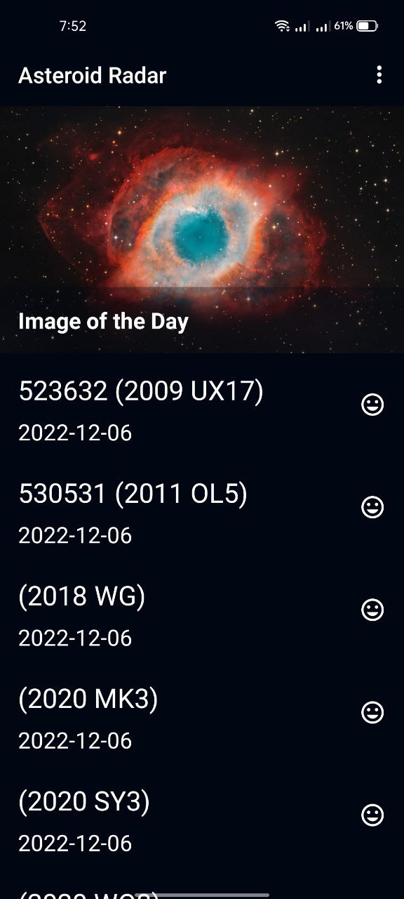
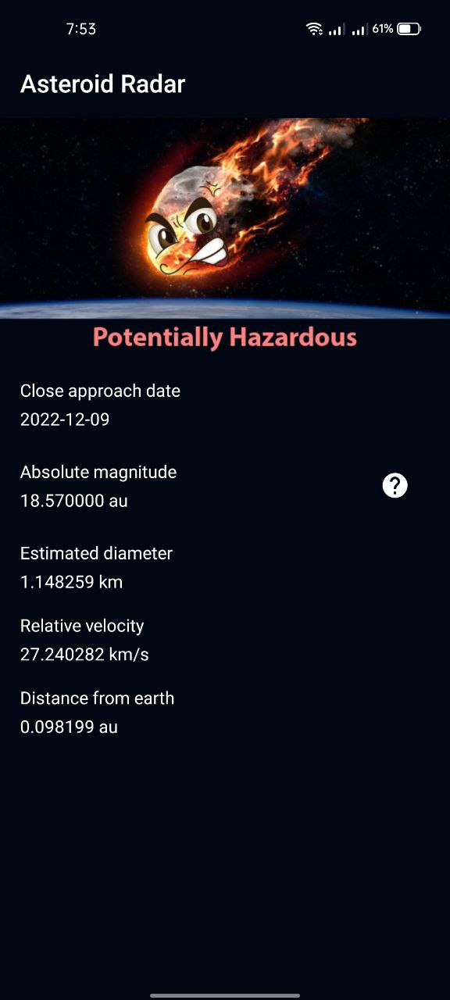
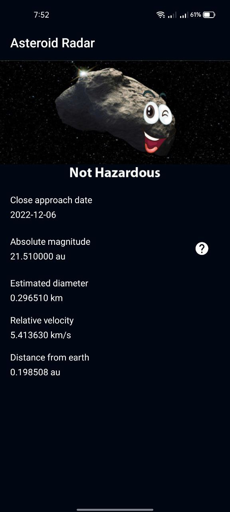
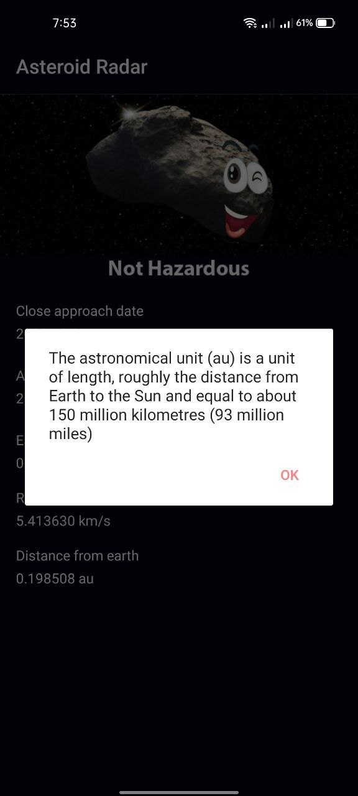
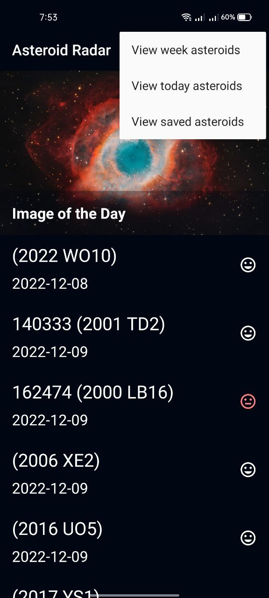
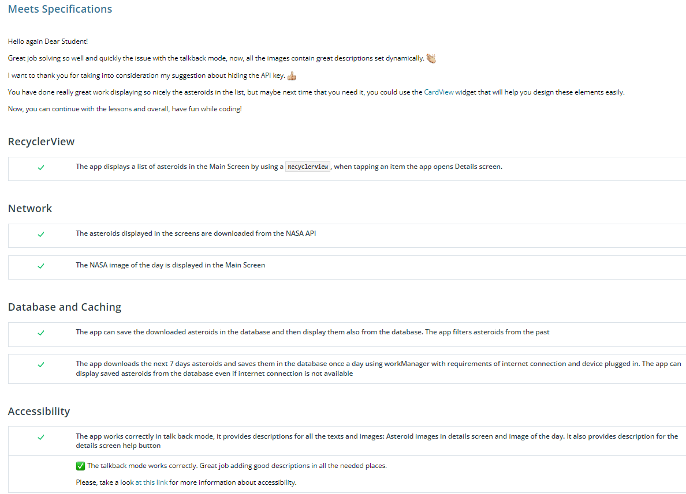

# Project Title

Asteroid Radar

## Getting Started

Asteroid Radar is an app to view the asteroids detected by NASA that pass near Earth, you can view all the detected asteroids in a period of time, their data (Size, velocity, distance to Earth) and if they are potentially hazardous.

The app is consists of two screens: A Main screen with a list of all the detected asteroids and a Details screen that is going to display the data of that asteroid once it´s selected in the Main screen list. The main screen will also show the NASA image of the day to make the app more striking.

This kind of app is one of the most usual in the real world, what you will learn by doing this are some of the most fundamental skills you need to know to work as a professional Android developer, as fetching data from the internet, saving data to a database, and display the data in a clear, clear, compelling UI.

### Some of the Technologies and Techniques Used
The app follows the MVVM Architecture Pattern and makes use of the following libraries.

- Room
- Moshi
- Picasso
- Retrofit2
- Data Binding
- RecyclerView
- WorkManager
- ConstraintLayout
- Kotlin Coroutines
- Accessibility Talkback
- Lifecycle Components
- Android Navigation Component

#### API KEY
To get an API Key from NASA to perform network requests to Nasa servers. You need to generate an api key by going to https://api.nasa.gov/

Then go to replace myApiNasa in build.gradle(:app) file with your API key.

## Screenshots

 
 
 
 
 

### Udacity Review
 
